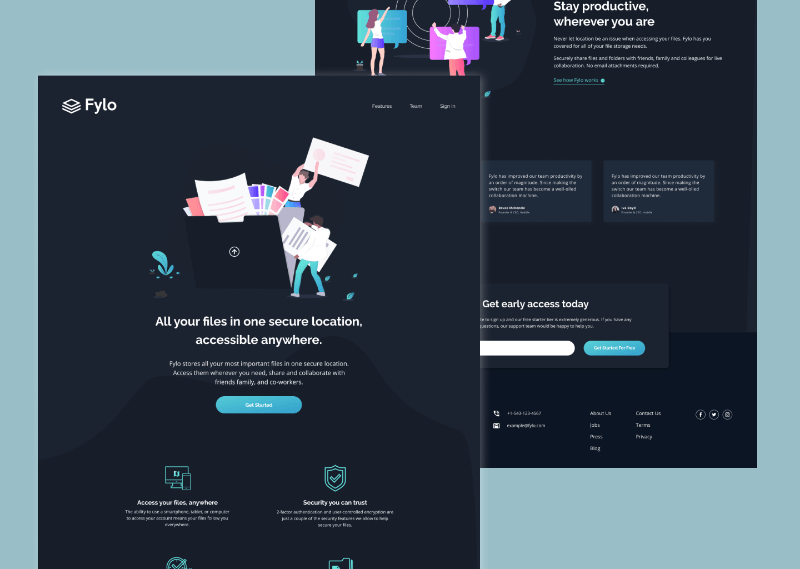

# Frontend Mentor - Fylo dark theme landing page solution

This is a solution to the [Fylo dark theme landing page challenge on Frontend Mentor](https://www.frontendmentor.io/challenges/fylo-dark-theme-landing-page-5ca5f2d21e82137ec91a50fd). Frontend Mentor challenges help you improve your coding skills by building realistic projects.

## Table of contents

-   [Overview](#overview)
    -   [The challenge](#the-challenge)
    -   [Screenshot](#screenshot)
    -   [Links](#links)
-   [My process](#my-process)
    -   [Built with](#built-with)
    -   [What I learned](#what-i-learned)
    -   [Continued development](#continued-development)
    -   [Useful resources](#useful-resources)
-   [Author](#author)

**Note: Delete this note and update the table of contents based on what sections you keep.**

## Overview

### The challenge

Users should be able to:

-   View the optimal layout for the site depending on their device's screen size
-   See hover states for all interactive elements on the page

### Screenshot



### Links

-   Solution URL: [Add solution URL here](https://your-solution-url.com)
-   Live Site URL: [Add live site URL here](https://your-live-site-url.com)

## My process

### Built with

-   Semantic HTML5 markup
-   CSS custom properties
-   Flexbox
-   CSS Grid
-   SCSS
-   Mobile-first workflow
-   [Feather Icons](https://feathericons.com/)

### What I learned

During this project, I learned more about how to use flexbox and the flex-basis and flex-grow properties. I used them specifically to make the testimonials cards responsive, without any media queries. It was helpful.

```scss
.element {
	flex-grow: 1;
	flex-basis: 280px;
	max-width: 360px;
}
```

In the beginning, I doesn't have consistency in the typography styles and repeated the same styles in different classes. I copied a little of the Bootstrap syntax (-sm-) to have more consistency in the typography styles.

```scss
.text {
	&--16 {
		font-size: rem(16);
		line-height: 24px;
	}

	@include breakpoint(small) {
		&--sm-16 {
			font-size: rem(16);
			line-height: 24px;
		}
	}
}
```

Related to the typography styles, I also learned to separate the font styles from others like margin or padding to have more clean styles.

```html
<h1 class="title--18 mb-30">All your files in one secure location, accessible anywhere.</h1>
```

```scss
.title {
	&--18 {
		font-family: var(--title-font);
		font-weight: bold;
		line-height: 36px;
		font-size: rem(24);
	}
}

.mb-30 {
	margin-bottom: rem(30);
}
```

### Continued development

I'll like to improve the styles of the project because it has little details related to the layout that I found a little confused.

I tried to follow the Figma design but it doesn't have a column-based layout, which results in specific styles for every section container. Maybe I'll change that in the future and add general styles for the sections.

### Useful resources

-   [Px to Em Functions](https://css-tricks.com/snippets/sass/px-to-em-functions/) - This function is specifically helpful to have more control over the breakpoints

```scss
$breakpoints: (
	"small": "39.9375em",
	"medium": "63.9375em",
	"large": "87.4375em",
);

@mixin breakpoint($size) {
	@media (min-width: map-get($breakpoints-up, $size)) {
		@content;
	}
}
```

## Author

-   Frontend Mentor - [@Javieer57](https://www.frontendmentor.io/profile/Javieer57)
-   Github - [@Javieer57](https://github.com/Javieer57)
-   Instagram - [@javieer57](https://www.instagram.com/javieer_57/)
